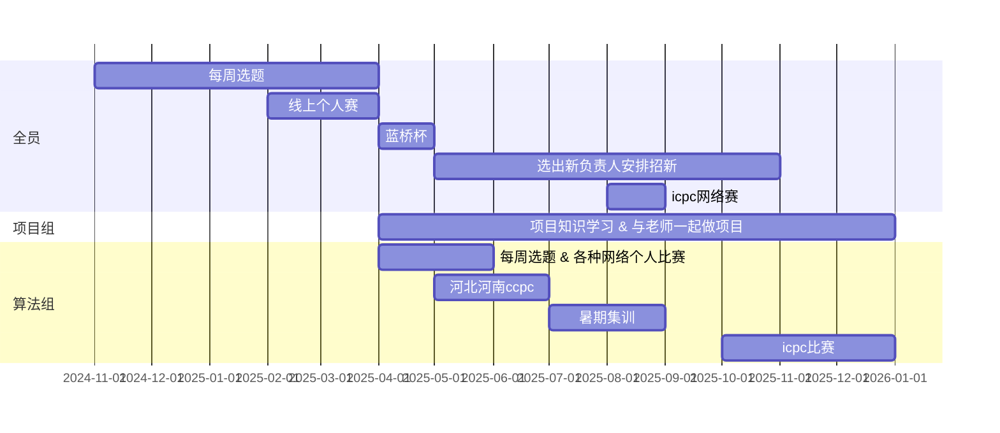

# 一、TUST-ACM战队简介
TUST-ACM战队成立于2024年5月。初始成员由贾舒奥维、赵子涵、王森、韩高臻组成。目标是代表TUST参加xcpc（icpc/ccpc）比赛。  
# 二、队员组成
# todo 填写个人信息
| 姓名 | github_id | 年级 | 学院 |
|:----:|:----:|:----:|:----:|
| 奥维 | guaidaokakaxi |  | 软件工程 |
| 柴渊元 | yvtian | Row 3 | Row 4 |
| ~~少辰~~ | csclzy | Row 3 | Row 4 |
| 韩高臻 | hangz | Row 3 | Row 4 |
| 黄天赐 | mjiumengm | Row 3 | Row 4 |
| 李迪菲 | Buckwheat. | Row 3 | Row 4 |
| 赵强 | Winndy | Row 3 | Row 4 |
| ~~廖玥珺~~ | Row 2 | Row 3 | Row 4 |
| 刘峻涛 | Iridium1234 | Row 3 | Row 4 |
| ~~刘浚昊~~ | Row 2 | Row 3 | Row 4 |
| 求哲 | KotoriItsuka | Row 3 | Row 4 |
| 石佳帅 | 404EX | Row 3 | Row 4 |
| 王炫懿 | Lynlane | Row 3 | Row 4 |
| 吴迪 | flowerplus | Row 3 | Row 4 |
| 吴文天 | Anatsumiki | Row 3 | Row 4 |
| 吴宇轩 | xuanandyi | Row 3 | Row 4 |
| ~~杨欣茹~~ | Row 2 | Row 3 | Row 4 |
| 殷雄 | Yyin3 393  | Row 3 | Row 4 |
| 赵兴理 | lillee | Row 3 | Row 4 |
| 郑俊岩 | VulpisFoglia | Row 3 | Row 4 |
| 朱世乐 | shileye666 | Row 3 | Row 4 |
| 贺江阳 | Sunstreamyheee | Row 3 | Row 4 |
| ~~陈子瑛~~ | Row 2 | Row 3 | Row 4 |
| ~~李享潞~~ | Row 2 | Row 3 | Row 4 |
| ~~王孙上~~ | Row 2 | Row 3 | Row 4 |
| ~~赵涵悦~~ | miaoaoaoz | Row 3 | Row 4 |
| ~~宋静姝~~ | Row 2 | Row 3 | Row 4 |

# 三、2024-2025 TimeLine

# 四、xcpc组建赛队、项目组&算法组分流策略
因经费 && xcpc比赛本身的名额限制, 无法全员参加, 仅会选出<=4个赛队(每个赛队3人)代表TUST参赛作为算法组, 其他人进入项目组, 分组策略如下:
1. 通过队内个人赛获得分数: 2025年2-3月期间, 我们将组织全员参加8至12场线上个人赛 ( 比赛平台包含codeforces、atcoder、力扣周赛、牛客竞赛、蓝桥杯等 ) 。每场比赛的得分将根据参赛者的名次进行累计。具体每场比赛的得分规则如下：

    | 比赛名次 | 得分 |
    |:----:|:----:|
    | 1    | 20     |
    | 2    | 15     |
    | 3    | 12     |
    | 4    | 10     |
    | 5    | 8     |
    | 6    | 7     |
    | 7    | 6     |
    | 8    | 5     |
    | 9    | 4     |
    | 10    | 3     |
    | >10    | 1     |
    | 未参加比赛（请假）  | 0     |
    | 矿工&&没请假    |  -1    |
    | 作弊一次    |  -20    |
    | 作弊>1次    |  取消入队资格    |

2. 全部个人赛结束后, 根据总得分排名, 名次最高的人, 优先挑选两名队友。被挑选的两名队友都同意加入该队伍后, 组成TUST算法一队。
3. 剩余的人按照相同的规则, 依次成立TUST算法二队、TUST算法三队、TUST算法四队（最多四队且女队不计入此总数）。
4. 剩余未入队的人分流至项目组进行项目的学习和参与。如后续经费充足 OR codeforces/atcoder 分数达到TUST二队的第一名的水平,仍有机会参加xcpc的比赛。

# 五、学习计划(暂列到25.1月)
| 时间 | 本周主题 | 本周知识点 | 本周可选知识点 | 选题小组 | 负责人 |
| :------------: | :---: | :--- | :--- | :------: | :---: |
| 第一周  11.4-11.10 | 基础数据结构 | 队列，栈，DFS，BFS | 熟悉C++ STL的queue, deque, stack | 奥维 | 韩高臻 |
| 第二周  11.11-11.17 | 基础排序，搜索 | 归并排序，二分查找  |  | 程少辰，柴渊元，陈子瑛 | 赵子涵 |
| 第三周  11.18-11.24 | 基础排序，数据结构 | 链表，快排（partition算法）  | 熟悉C++的指针用法 | 黄天赐，李迪菲，赵强 | 王森 |
| 第四周  11.25-12.1 | 数据结构深入 | 单调栈，单调队列，优先队列，并查集  |  | 李享潞，郑俊岩，刘峻涛 | 韩高臻 |
| 第五周  12.2-12.8 | 数论入门 | GCD & LCM，裴蜀定理  |  | 廖玥珺，刘浚昊，宋静姝 | 赵子涵 |
| 第六周  12.9-12.15 | 数论入门 | 素数筛法（欧拉筛），分解质因数，大数取模，快速幂  |  | 石佳帅，赵兴理，杨欣茹 | 王森 |
| 第七周  12.16-12.22 | 动态规划入门 | 背包问题（0/1背包，完全背包），最大子数组和，最长上升子序列，找钱问题 |  | 赵涵悦，殷雄，王孙上 | 韩高臻 |
| 第八周  12.23-12.29 | 树，图入门 | 最短路径算法（Dijkstra & Floyd），树和图的搜索查找（DFS/BFS） | 学会C++建图 & 树  | 郑俊岩，黄天赐，王炫懿 | 赵子涵 |
| 第九周  12.30-1.5 | 图论算法加强 | 拓扑排序，树上倍增（LCA），树上DP | 深入理解凸轮 | 吴宇轩，吴文天，吴迪 | 王森 |
| 第十周  1.6-1.12 | 字符串 | Trie，KMP算法，Rabin-Karp算法 |  | 程少辰，柴渊元，求哲 | 韩高臻 |
| 第十一周 1.13-1.19 | 位运算操作 | 各种位运算(与, 或, 异或,非,进制运算， lowbit)性质 |  | 吴文天，吴宇轩，李享潞 | 赵子涵 |
| 第十二周 1.20-1.26 | 博弈入门 | Nim游戏，SG函数，Grundy numbers（Mex） |  | 李迪菲，石佳帅，赵兴理 | 王森|
|  |  |  |  |  |  |

# 六、每周选题运行机制
### 1. 选题小组:
除三位负责人外(赵子涵、王森、韩高臻), 每3人组成一个选题小组, 每个选题小组负责`下一周`的训练工作, 具体内容为:
1. `提前学习` `不限时间` : 小组3人自行提前学习下周知识点
2. `选题单` `本周三` `21:00前完成` : 选题小组的3人结合过去及下周知识点选题, 每周选题量为10~20题。选完后交由赵子涵、王森、韩高臻 三人确认选题单中的题的质量。  
    - 题目记录在 https://github.com/guaidaokakaxi/TUST-ACM/blob/main/quesitons.md
    - 模仿第一周创建一个第N周的表格（直接复制第一周）然后改一下列名为当前选的题目。https://github.com/users/guaidaokakaxi/projects/3/views/2  
    - 具体题目数量取决于题目难度，如果偏难题目数量就少一点，不要脱离大部队的实力选题，比如选cf2000分的题，没有任何意义  
    - 题单选择可参考：https://github.com/EndlessCheng/codeforces-go/blob/master/leetcode/SOLUTIONS.md  or https://github.com/Lightblues/Leetcode
    - 题单不用局限于什么平台，力扣，cf，atc等等都无所谓，关键是保证题目质量。  
3. `验题` `本周日 21:00前完成` : 小组内3人互相验证对方选择的题。  
    验题标准: `不能挑选太难的题目，比如3人发现自己题解都看不懂的题不能选；不能挑太简单，比如3人都觉得这题一眼会做`
4. `督促全员完成` `下周日 21:00前` : 下周一到周日中,隔1-2天督促全员完成选出的题单中的题目并在群里回答其他人对题目的疑问。下周日21:00汇总全员完成情况发到群里。

### 2. 负责人:
三位负责人(赵子涵、王森、韩高臻)每人一周,轮流负责`督促`选题小组完成`下一周`的进度,具体内容为:
1. 提前学习下周知识点。
2. 督促选题小组在 `本周三 21:00前` 完成下周的选题。
3. 检查选题小组的题目在知识点、难度、重复性等方面是否适合。
4. 督促选题小组在 `本周日 21:00前` 完成下周题目的验题并发送github链接到群里。
5. 督促选题小组在 `下周日 22:00前` 将完成情况汇总发送在群里。

### 3. 全员:
1. 由于队员各自的专业课时间不同,24.11月-25.3月期间不组织集中的现场训练,全员至少完成每周选出的题来学习算法知识,预估每周需要的学习时间为30-50小时。
2. `自愿参加` 每周五晚上的老师授课
3. `必须完成` 学习本周知识点
4. `必须完成` `本周日 20:00前` 本周题单中的题目,并在github的projects上更新自己的题目完成情况。https://github.com/users/guaidaokakaxi/projects/3/views/2

# 七. 2024寒假训练计划及要求
## 开学前要求24级同学Codeforces打到1200分以上，23级同学要求打到1300分以上 (强制)
## 寒假期间（1.11号至2月23号）要求Codeforces所有比赛全勤 (尽量)
## 寒假期间要求刷题总量不得低于150题，要求每天稳定刷3-8题(之前作业没怎么做的强制要每天5题以上，否则视为放弃)，尽量不要出现前期不刷后期猛补的情况 (尽量)
## 寒假期间所有的队内训练vp要求全勤 ，频率为2～3天一场vp(尽量)
## 所有之前没做完的作业要做完（最好不要拖到寒假做，寒假训练量很大）(最好)
## 以上内容无特殊情况不得请假，如果cf已经打到1700分以上可以无视上述规则 (强制)
## 所有比赛不要作弊 (强制)
## 不打算法组的，提前！！提前！！！提前找三位负责人说明，节省双方时间 (强制)
## 全员每周汇报学习进度
### 小组1
组员：柴渊元，朱世乐，殷雄，吴宇轩，吴文天
汇报负责人：高臻
### 小组2
组员：求哲，石佳帅，王炫懿，吴迪，赵兴理，郑俊岩
汇报负责人：王森
### 小组3
组员：黄天赐，赵强，贺江阳，刘峻涛，李迪菲
汇报负责人：子涵

## 每周汇报内容（具体格式每组可负责人自行要求）
1. 作业进度
2. 做题进度
3. 队内赛vp训练进度
4. 线上比赛（包括但不限于cf，atc，力扣，牛客，洛谷）打的情况
## 奖品（截止日期是2月23号）
### cf
#### 大一&大二cf排名第一 奖品每人现金100元
#### 大一&大二cf排名第二 奖品书籍《csapp》
#### 大一&大二cf排名第三 奖品书籍《黑客与画家》
### 牛客寒假训练营
#### 大一&大二 训练营排名第一 奖品《具体数学》
#### 大一&大二 训练营排名第二 奖品《图解TCP/IP》
